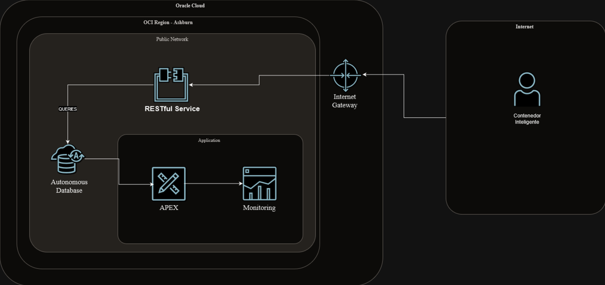
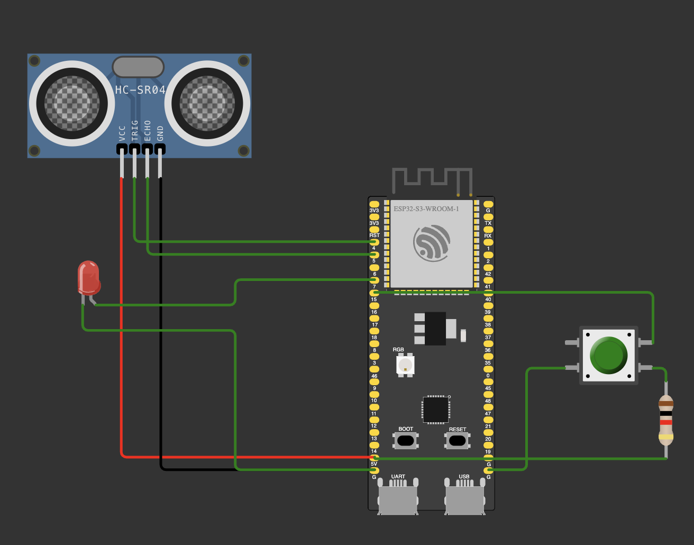

# SMART CONTAINER IOT DEVICE

I recently participated in the TecNM Oracle Cloud Challenge, my team and I came up with the idea of smart containers for helping out with the management of the garbage collection. In this repository you can find the IOT part which makes the container smart.

## Architecture



This repository is the client of our application. The microcontroller will send an https POST request to *RESTful services* when the trash goes above the desired level. Then *RESTful services* will update *Autonomous Database*, and new information is going to be shown in *APEX*.

## Circuit

### Materials

- Esp32S3
- HC-SR04 Ultrasonic Sensor
- Push Button
- 10 KOhm Resistor
- LED
- 220 Ohm Resistor

### Diagram



## Cloning the project

Assuming you have Rust already installed following the official tutorial the next step is adding the toolchain to compile rust for your architecture. Most of rustaceans are using the *Esp32C3* board which uses a RISC-V processor architecture but since I am using the *Esp32S3* board, this one uses an Xtensa architecture. [Check out](https://docs.esp-rs.org/book/installation/index.html) for further information.

Now clone the repository and build the project. (Note that if you are using another architecture instead of cloning the repository you will have to create another project and then copy the files inside the `/src` folder to your project, as well as the dependencies in the `Cargo.toml` file)

```sh
git clone https://github.com/RamMaths/iot-manager
cargo build --release
```

If you succesfully build the project now you have to flash the board. For this I am using [espflash](https://docs.esp-rs.org/book/tooling/espflash.html). Since our application has some dependencies our binary will get a bit larger than we might expect thus we have to extend the flash size.

```sh
# example
espflash flash ./target/xtensa-esp32s3-espidf/release/ultrasonic -p /dev/cu.usbmodem1301 --flash-size 16mb --monitor
```

## Software Explanation

I love writing rust so this project is not the exception. Espressif provides support for Esp32S3 and more boards, read more about Rust on Espressif [here](https://docs.esp-rs.org/book/introduction.html). 

This board supports the esp-idf framework, allowing us to develop std applications. This is helpful for simplifying the process of connecting to wifi, using threads, allocating memory dinamically, creating the https client, at a cost of a larger binary file.

This project uses two threads, one running the main application and another one using the `HC-SR04` sensor measuring the distance between the top of the container and the actual trash level, they both will use the crate `crossbeam-channel`, allowing them to communicate with each other.

The thread using the sensor will act as the "Sender"

```rs
pub fn ultrasonic_thread_function(
    twdt: &mut TWDTDriver,
    mut ultrasonic: Ultrasonic,
    tx: crossbeam_channel::Sender<f32>,
) -> anyhow::Result<()> {
    // Measuring logic...
}
```
The main thread is the "Receiver", getting the distance in centimeters from the ultrasonic sensor thread.

```rs
static ULTRASONIC_STACK_SIZE: usize = 2000;

fn main() -> anyhow::Result<()>{
    //setup logic

    let (tx, rx) = bounded::<f32>(1);

    // Registering the sensor thread
    // the sensor thread will take "tx"
    let _ultrasonic_thread = std::thread::Builder::new()
        .stack_size(ULTRASONIC_STACK_SIZE)
        .spawn(move || threads::ultrasonic_thread_function(&mut driver, ultrasonic, tx))?;

    let mut distance = -1.0;

    loop {
        // we receive information from the other thread with "rx"
        match rx.try_recv() {
            Ok(x) => {
                distance = x;
                ready = true;
                println!("distance: {}", distance);
            }
            Err(_) => {}
        }

        // logic for sending the request if a distance goes over some metric
    }
}
```
